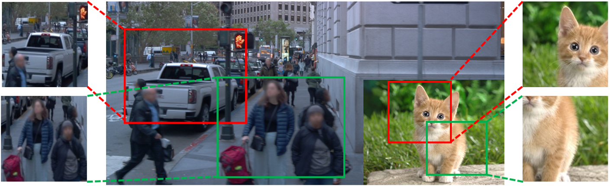
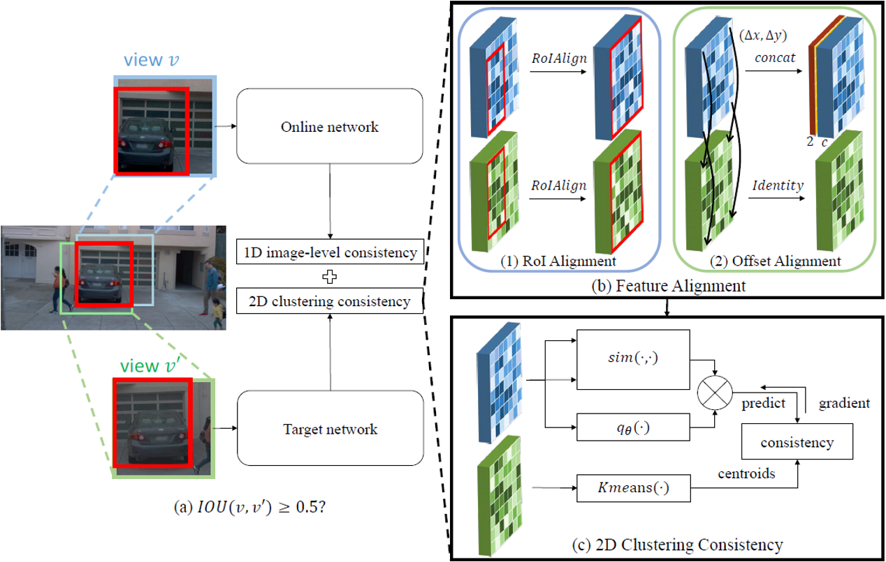
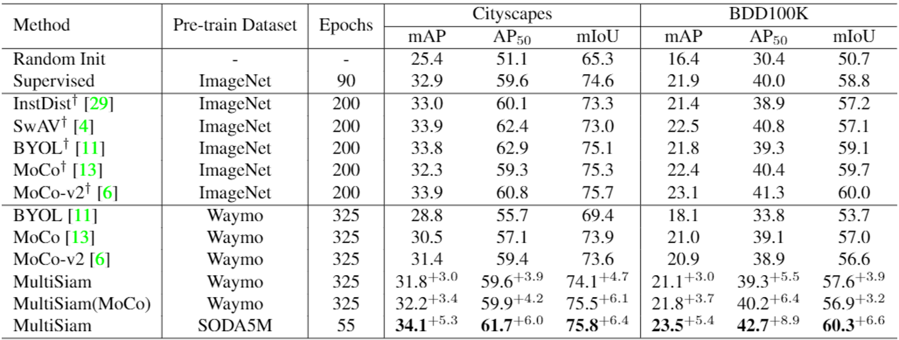
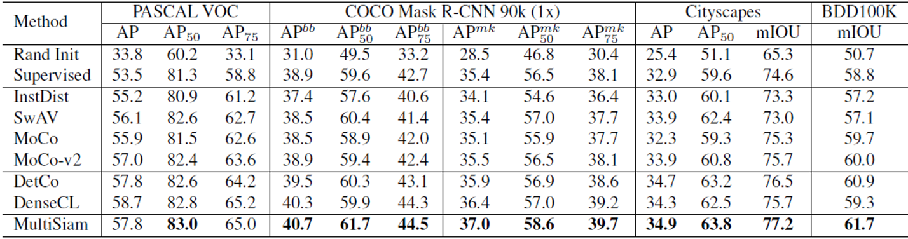
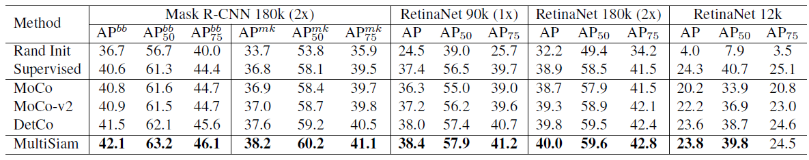
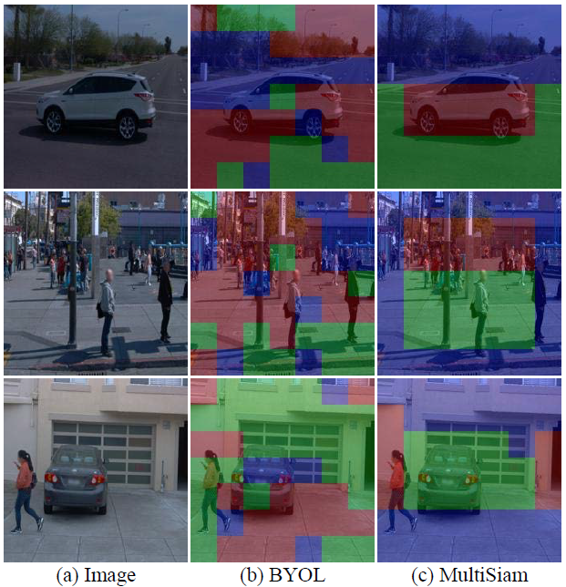

# MultiSiam: Self-supervised Multi-instance Siamese Representation Learning for Autonomous Driving

Code will be available soon.


## Motivation




## Architecture




## Experiment

### Pre-train on multi-instance datasets




### Pre-train on single-instance ImageNet






### Visualization




## Citation

```
@inproceedings{chen2021multisiam,
  title={MultiSiam: Self-supervised Multi-instance Siamese Representation Learning for Autonomous Driving},
  author={Chen, Kai and Hong, Lanqing and Xu, Hang and Li, Zhenguo and Yeung, Dit-Yan},
  booktitle={Proceedings of the IEEE/CVF International Conference on Computer Vision},
  pages={7546--7554},
  year={2021}
}
```

